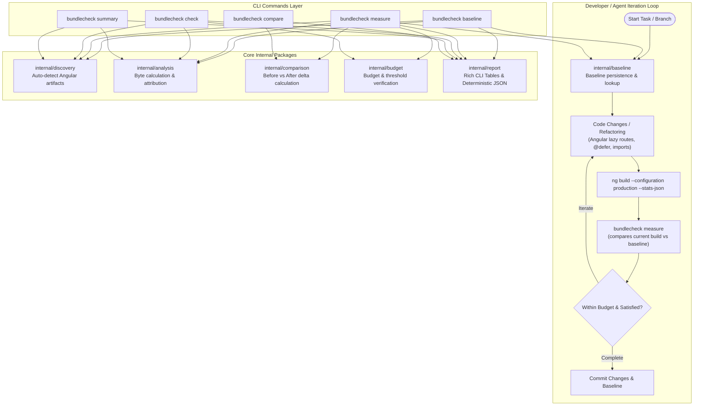

# Architecture & Implementation Plan: Baseline Measurement, Developer CLI & AI Agent Skill for `bundlecheck`

**Last updated**: 2026-09-18  
**Status**: Approved for implementation

---

## Overview & Vision

`bundlecheck` is designed to be both:
1. A **Developer CLI** providing fast, zero-config bundle analysis, baseline tracking, and CI regression checks.
2. An **AI Agent Skill** providing structured, deterministic byte facts, Angular optimization workflows, and before/after verification for AI assistants (Antigravity CLI, Claude Code, OpenAI Codex, Cursor, Windsurf).

---

## Core Capabilities to Implement

### 1. Baseline Measurement & Iterative Change Tracking (`measure` workflow)
- **Establish Baseline**: `bundlecheck baseline` analyzes the current build and saves the reference snapshot to `.bundlecheck/baseline.json` (or customizable via `--baseline <path>`).
- **Measure Subsequent Changes**: `bundlecheck measure` automatically compares the current build against `.bundlecheck/baseline.json`.
  - Eliminates the need to manually manage temporary `before.json` / `after.json` files during iterative refactoring.
  - Supports regression limits (e.g. `--max-initial-delta 0B`, `--max-total-delta 50KB`).
  - Enables a tight feedback loop for developers and AI agents:
    ```
    bundlecheck baseline -> edit code -> ng build -> bundlecheck measure -> repeat
    ```

### 2. Zero-Config Artifact Auto-Discovery (`internal/discovery`)
- In standard Angular projects (Angular 17–22+), builds produce `dist/<app>/stats.json` and `dist/<app>/browser/index.html`.
- When `--stats` and `--dist` flags are omitted, `bundlecheck` automatically scans `dist/` and detects the matching build outputs.
- In multi-project monorepos, supports `--project <name>` or presents an interactive/clear candidate list.
- If artifacts are missing, outputs actionable hints (`Run 'ng build --configuration production --stats-json'`).

### 3. Developer Ergonomics & Formatting
- **Short Flag Aliases**: `-s` (`--stats`), `-d` (`--dist`), `-p` (`--project`), `-f` (`--format`), `-o` (`--output`), `-b` (`--before`), `-a` (`--after`).
- **File Output (`-o, --output`)**: Write JSON snapshots or text directly to disk without shell redirection quirks.
- **Enhanced Human Text Reports**:
  - Percentage share calculation for package initial contributions (e.g. `@angular/core  30 KB (18.7%)`).
  - Configurable top package count (`--top <n>`, default 10; `--all` to view all).
  - Package name filtering (`--filter <name>`).
- **Budget & CI Enforcement (`bundlecheck check`)**:
  - Validates static budgets (`--max-initial 200KB`, `--max-total 500KB`) or delta budgets against a baseline.
  - Returns exit code `0` on success and `1` on budget violation.

### 4. Multi-Platform AI Agent Skill Integration
- **Universal Skill (`.agents/skills/bundlecheck/SKILL.md`)**:
  - Complete playbooks for AI agents:
    1. Baseline capture (`bundlecheck baseline`).
    2. Angular size optimization patterns (lazy routes `loadComponent: () => import(...)`, `@defer`, tree-shaking).
    3. Quantitative verification (`bundlecheck measure --format json`).
    4. Diagnostic error recovery.
- **Enhanced Installer (`install.sh`)**:
  - Support `--with-skill` targeting `$HOME/.agents/skills/bundlecheck` and `$HOME/.gemini/antigravity-cli/skills/bundlecheck`, with `--skill-dir <DIR>` for custom setups.

---

## Architectural Design



---

## Package Breakdown & File Structure

```
bundlecheck/
├── .agents/
│   └── skills/
│       └── bundlecheck/
│           └── SKILL.md                 # Universal AI agent skill definition
├── cmd/
│   ├── root.go                          # CLI root orchestration
│   ├── summary.go                       # Summary command (with auto-discovery, -o, --top)
│   ├── compare.go                       # Compare command (with -o, --top, default baseline)
│   ├── baseline.go                      # [NEW] Baseline command
│   ├── measure.go                       # [NEW] Measure command (current vs baseline)
│   └── check.go                         # [NEW] Budget & CI verification command
├── docs/
│   ├── agents.md                        # Agent guide & JSON contract
│   ├── plan.md                          # [NEW] This design & architecture plan
│   └── progress.md                      # Milestone & progress tracker
├── internal/
│   ├── analysis/                        # Byte totals & package aggregation
│   ├── angular/                         # Metafile parsing & path normalization
│   ├── artifact/                        # index.html script matching & browser file filtering
│   ├── baseline/                        # [NEW] Baseline store & resolution
│   ├── budget/                          # [NEW] Threshold parsing & budget evaluations
│   ├── comparison/                      # Before/After comparison logic
│   ├── discovery/                       # [NEW] Angular build auto-discovery
│   ├── graph/                           # Static dependency graph traversal
│   ├── report/                          # JSON and Human-readable Text reports
│   └── snapshot/                        # Core domain models
├── install.sh                           # Multi-agent skill & CLI installer
├── install_test.go                      # Installer tests
├── main.go                              # Entry point & exit code handling
└── README.md                            # Main project documentation
```

---

## Verification & Validation Plan

### Automated Test Suite
- `rtk go test -v ./...`: Full test suite covering parsing, graph classification, comparison, auto-discovery, budget validation, baseline persistence, and CLI commands.
- `rtk go vet ./...`: Static analysis and linting.
- `rtk go test -v ./install_test.go`: Installer options and skill target directories.

### Verification Scenarios
1. **Zero-Config Auto-Discovery**:
   - Run in standard Angular project directories without `--stats` or `--dist`.
2. **Baseline & Measure Flow**:
   - Run `bundlecheck baseline` on initial build.
   - Run `bundlecheck measure` on subsequent build; assert deltas match.
3. **CI Regression & Threshold Check**:
   - Run `bundlecheck check --max-initial <limit>` and verify zero/non-zero exit codes.
4. **Agent Skill Execution**:
   - Test agent prompt execution using `$bundlecheck` skill across sample Angular builds.
