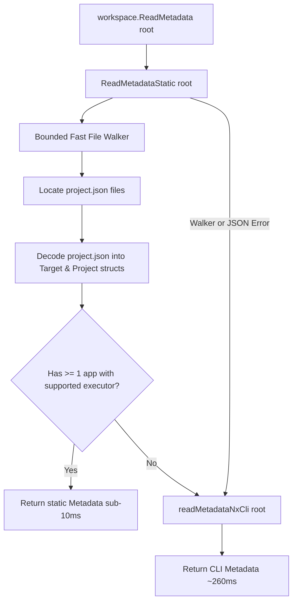

# Design Specification: Fast-Path Static Nx Metadata Parser

**Author**: Antigravity
**Date**: 2026-09-19
**Status**: Implemented & Verified
**Target Milestone**: Feature A (Roadmap Stage 2.3)

---

## 1. Overview & Goals

In Nx enterprise workspaces, `bundlecheck workspace summary` currently calls `node node_modules/nx/bin/nx.js graph --print` to retrieve project definitions and targets. On Node.js runners, this incurs a constant ~260ms VM initialization and graph compilation overhead even for small and medium workspaces.

### Goals
1. **Sub-10ms Workspace Discovery**: Parse modern Nx workspace structure directly in pure Go by traversing `project.json` files and workspace configuration.
2. **Zero-Dependency Execution**: Allow `bundlecheck workspace` to inspect existing build artifacts even when `node_modules` is absent or Node.js runtime is unavailable.
3. **100% Backward Compatibility**: Seamlessly fall back to `node nx graph --print` whenever dynamic Nx plugins, inferred targets, or complex workspace configurations are encountered.
4. **Exact Equivalence**: Produce identical `workspace.Metadata` models (projects, targets, executors, options, configurations) as the Nx CLI output for standard Angular applications.

---

## 2. Architecture & Data Flow



---

## 3. Component Details

### 3.1 `internal/workspace/static.go`

A new dedicated Go module providing pure-Go static discovery:

```go
type projectJSON struct {
    Name        string            `json:"name"`
    ProjectType string            `json:"projectType"`
    Targets     map[string]Target `json:"targets"`
}

func ReadMetadataStatic(root string) (Metadata, error)
```

#### Discovery Rules
1. **Root Configuration**: Check `root/nx.json` exists; if not, return error immediately.
2. **Bounded Traversal**: Walk directory trees from `root` with depth limit of 4, excluding:
   - Directories starting with `.` (e.g. `.git`, `.nx`, `.cache`, `.github`)
   - `node_modules`, `dist`, `coverage`, `tmp`
3. **Project Identification**:
   - For every directory containing `project.json`, read and decode the JSON manifest.
   - If `projectJSON.Name` is specified, use it as the project key; otherwise, use `filepath.Base(dir)`.
   - Calculate relative path from `root` to directory as `project.Data.Root` (e.g. `"apps/admin-dashboard"`).
   - Set `project.Data.ProjectType` from `projectJSON.ProjectType`.
   - Set `project.Type = "app"` if `projectType == "application"` else `"lib"`.
   - Transfer `projectJSON.Targets` into `project.Data.Targets`.
4. **Validation Check**:
   - Iterate over discovered nodes. Ensure at least one project satisfies `IsApplication(p)` and has a build target with a supported Angular executor (`Supported(p, target)`).
   - If zero supported applications are found, return `ErrStaticFallbackRequired`.

### 3.2 Integration with `internal/workspace/nx.go`

Refactor `ReadMetadata(ctx context.Context, root string) (Metadata, error)`:
```go
func ReadMetadata(ctx context.Context, root string) (Metadata, error) {
    if m, err := ReadMetadataStatic(root); err == nil && len(m.Graph.Nodes) > 0 {
        return m, nil
    }
    return readMetadataNxCli(ctx, root)
}
```

Where `readMetadataNxCli` preserves the existing battle-tested `node nx graph --print` execution logic.

---

## 4. Edge Cases & Handling

| Scenario | Behavior |
| :--- | :--- |
| **Inferred Targets (@nx/angular:application plugin in nx.json without project.json targets)** | Static parser detects missing targets and returns `ErrStaticFallbackRequired`; CLI graph runs transparently. |
| **`node_modules` not installed (lean CI / Docker)** | Static parser succeeds without requiring `node` or `node_modules/nx`. |
| **Monorepo with nested apps (`apps/marketing/portal`)** | Bounded walk up to depth 4 finds nested `project.json` without infinite recursion. |
| **Symlinked directories** | Directory walker respects `os.FileInfo.Mode().IsDir()` and avoids recursive symlink loops. |
| **Malformed `project.json`** | Treated as static parse failure; falls back to CLI. |

---

## 5. Testing & Verification

1. **Equivalence Test (`internal/workspace/static_test.go`)**:
   - Run `ReadMetadataStatic` on `testdata/nx-workspace`.
   - Compare nodes, project types, targets, and output directory resolution with `readMetadataNxCli`. Assert 100% equivalence.
2. **Missing Node Modules Resiliency Test**:
   - Test `ReadMetadataStatic` in a temporary copy of `testdata/nx-workspace` with `node_modules` completely removed; assert it succeeds and produces valid application projects.
3. **Benchmarks**:
   - Add `BenchmarkReadMetadataStatic` in `internal/workspace/nx_test.go`.
   - Verify execution completes in `< 5ms`.
