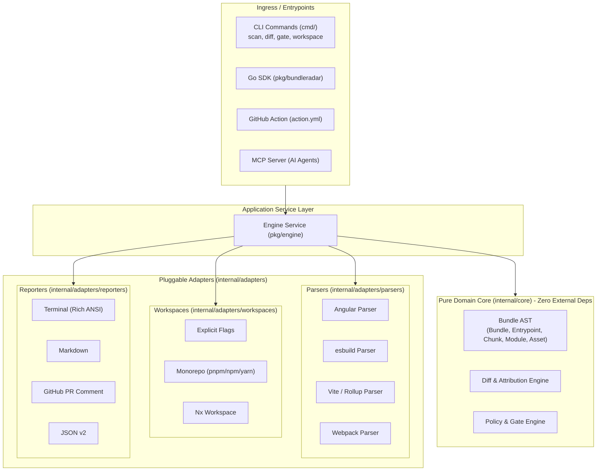

# BundleRadar v2: Clean-Slate Modular Architecture Design

**Date:** 2026-09-23  
**Status:** Approved  
**Author:** Sonu Kumar & Antigravity  

---

## 1. Executive Summary

BundleRadar v2 is a clean-slate, breaking redesign that transitions BundleRadar from an Angular/esbuild-specific analyzer into a **universal, framework-agnostic, zero-dependency bundle analysis, diffing, and budget gate engine**.

### Core Tenets
1. **Zero External Runtime Dependencies**: A standalone native Go binary that requires no Node.js, npm, Nx, or Python.
2. **Framework & Bundler Agnostic**: Universal AST representing bundles from any tool (esbuild, Vite, Rollup, Webpack, Turbopack) and framework (React, Next.js, Vue, Angular, Svelte).
3. **Hexagonal (Ports & Adapters) Architecture**: Clean separation between pure domain models (`internal/core`), pluggable ingress parsers and workspace resolvers (`internal/adapters/`), and egress reporters (`internal/adapters/reporters`).
4. **Streamlined Orthogonal CLI**: Replaces historical, overlapping commands with 4 clear verbs: `scan`, `diff`, `gate`, and `workspace`.
5. **Programmatic Go SDK**: Exported public Go package (`pkg/bundleradar`) enabling native integration into external Go tools.

---

## 2. System Architecture



---

## 3. Package Layout

```text
bundleradar/
├── cmd/                          # Thin CLI Layer (Flag parsing & UX exit codes)
│   ├── root.go
│   ├── scan.go                   # Inspect, why, entrypoints, top packages
│   ├── diff.go                   # Comparisons vs baseline file or git ref
│   ├── gate.go                   # Hard budget & policy gates in CI
│   └── workspace.go              # Monorepo multi-project discovery
│
├── pkg/                          # Public Go SDK
│   ├── bundleradar/              # Client API
│   └── schema/                   # Public JSON types & contract definitions
│
├── internal/
│   ├── core/                     # Pure Domain Model & Ports (Zero 3rd-party imports)
│   │   ├── bundle.go             # Universal AST (Entrypoint, Chunk, Module, Asset)
│   │   ├── ports.go              # Interfaces: Parser, WorkspaceResolver, BaselineProvider, Reporter
│   │   ├── diff/                 # Universal Diff & Source Attribution Engine
│   │   │   └── diff.go
│   │   └── policy/               # Budget & Architecture Rule Evaluator
│   │       └── policy.go
│   │
│   └── adapters/                 # Pluggable Implementations
│       ├── parsers/              # Bundler Parsers & Auto-detection Registry
│       │   ├── registry.go
│       │   ├── angular.go
│       │   ├── esbuild.go
│       │   ├── vite.go
│       │   └── webpack.go
│       │
│       ├── workspaces/           # Workspace Resolvers
│       │   ├── registry.go
│       │   ├── explicit.go
│       │   ├── monorepo.go
│       │   └── nx.go
│       │
│       ├── baselines/            # Baseline Storage
│       │   ├── local.go
│       │   └── git.go
│       │
│       └── reporters/            # Egress Formatting
│           ├── terminal.go
│           ├── markdown.go
│           ├── github_pr.go
│           └── json.go
```

---

## 4. Universal Domain Model (`internal/core/bundle.go`)

The core AST captures bundle composition across any compilation pipeline:

```go
package core

type LoadType string

const (
    LoadTypeInitial LoadType = "initial" // Blocking critical assets (first paint)
    LoadTypeAsync   LoadType = "async"   // Dynamically imported lazy chunks
    LoadTypeWorker  LoadType = "worker"  // Web & Service Workers
)

type Bundle struct {
    Metadata    Metadata              `json:"metadata"`
    Entrypoints map[string]Entrypoint `json:"entrypoints"`
    Chunks      []Chunk               `json:"chunks"`
    Modules     []Module              `json:"modules"`
    Assets      []Asset               `json:"assets"`
}

type Entrypoint struct {
    Name             string   `json:"name"`
    InitialBytes     int64    `json:"initialBytes"`
    InitialGzipBytes int64    `json:"initialGzipBytes"`
    AsyncBytes       int64    `json:"asyncBytes"`
    ChunkIDs         []string `json:"chunkIds"`
}

type Chunk struct {
    ID        string   `json:"id"`
    Name      string   `json:"name"`
    Path      string   `json:"path"`
    SizeBytes int64    `json:"sizeBytes"`
    GzipBytes int64    `json:"gzipBytes"`
    Type      LoadType `json:"type"`
    Entry     string   `json:"entry,omitempty"`
    ModuleIDs []string `json:"moduleIds"`
}

type Module struct {
    ID           string   `json:"id"`
    Package      string   `json:"package,omitempty"`
    Version      string   `json:"version,omitempty"`
    SizeBytes    int64    `json:"sizeBytes"`
    GzipBytes    int64    `json:"gzipBytes"`
    IsAppCode    bool     `json:"isAppCode"`
    ChunkIDs     []string `json:"chunkIds"`
    IngressPaths []string `json:"ingressPaths"`
}

type Asset struct {
    Path      string `json:"path"`
    SizeBytes int64  `json:"sizeBytes"`
    GzipBytes int64  `json:"gzipBytes"`
    MimeType  string `json:"mimeType"`
}
```

---

## 5. Pluggable Ingress Ports (`internal/core/ports.go`)

```go
package core

import (
    "context"
    "io"
)

type Target struct {
    Name      string
    StatsPath string
    DistPath  string
    Bundler   string
}

type Parser interface {
    Name() string
    Detect(statsContent []byte, distDir string) bool
    Parse(ctx context.Context, target Target) (*Bundle, error)
}

type WorkspaceResolver interface {
    Name() string
    Detect(root string) bool
    Resolve(ctx context.Context, root string) ([]Target, error)
}

type BaselineProvider interface {
    Name() string
    Fetch(ctx context.Context, ref string) (*Bundle, error)
    Save(ctx context.Context, bundle *Bundle, dest string) error
}

type Reporter interface {
    Format() string
    Render(ctx context.Context, w io.Writer, data any) error
}
```

---

## 6. Diff & Policy Engine

### Diff (`internal/core/diff`)
- Computes per-entrypoint deltas (initial JS, initial gzip wire size, async chunk size).
- Identifies added/removed/modified chunks.
- Maps package regressions to exact source file attributions.
- Collapses sub-threshold changes (`<1KB`) into micro-drift buckets.

### Policy (`internal/core/policy`)
- Evaluates absolute thresholds (`MaxInitial`, `MaxTotal`, `MaxInitialDelta`).
- Scans bundle modules for forbidden libraries (`forbid: [moment, lodash]`).
- Detects multiple bundled versions of identical packages (e.g. `rxjs@6` and `rxjs@7`).
- Emits clean `EvaluationResult` with `Passed bool`, `Violations []Violation`, and `Warnings []Violation`.

---

## 7. Streamlined CLI Surface (`cmd/`)

| Command | Usage | Description |
| :--- | :--- | :--- |
| **`scan`** | `bundleradar scan [target]` | Analyzes bundle sizes, breakdowns, package contributors, and package import roots (`--why`). |
| **`diff`** | `bundleradar diff <target> --against <git_ref\|file>` | Compares current build against a baseline or git ref with regression attribution. |
| **`gate`** | `bundleradar gate [target...]` | Validates size budgets and rules; exits 0 on pass or 1 on policy violation. |
| **`workspace`** | `bundleradar workspace [list\|scan]` | Discovers and audits multi-application monorepos. |

---

## 8. Migration & Rollout Strategy

1. **Dedicated Feature Branch (`v2-redesign`)**: All work proceeds in isolation from `master`.
2. **Phase 1: Core AST & Ports**: Implement `internal/core` models and interfaces.
3. **Phase 2: Adapters**:
   - Parsers: `esbuild`, `angular`, `vite`, `webpack`.
   - Workspace: `explicit`, `monorepo`, `nx`.
   - Reporters: `terminal`, `markdown`, `github-pr`, `json`.
4. **Phase 3: Diff & Policy Engine**: Implement `internal/core/diff` and `internal/core/policy`.
5. **Phase 4: CLI Wiring**: Implement `cmd/scan.go`, `cmd/diff.go`, `cmd/gate.go`, and `cmd/workspace.go`.
6. **Phase 5: Golden Contracts & Verification**: Validate against fixture repositories across Angular, Vite, and esbuild.
