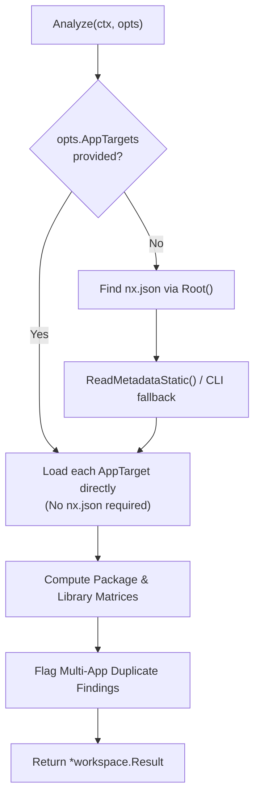

# Design Specification: Explicit Multi-App Tracking (Decoupled from Nx)

**Author**: Antigravity
**Date**: 2026-09-23
**Status**: Approved
**Target Milestone**: Feature (Multi-App & CI Tracking)

---

## 1. Overview & Problem Statement

Currently, BundleRadar's multi-application capabilities are tightly coupled to Nx:
- `bundleradar workspace summary` insists on finding an `nx.json` file in an ancestor directory and uses either static `project.json` parsing or executes `node node_modules/nx/bin/nx.js graph --print`.
- Workspaces using **Turborepo, pnpm/npm/yarn workspaces, standard Angular CLI multi-projects (`angular.json`), Lerna, or custom subfolder layouts** are completely unsupported in `workspace summary`.
- `bundleradar check` only evaluates a single application's `stats.json` per execution. To track multiple apps in CI, consumers must configure a GitHub Actions `strategy.matrix` or write custom bash loops.
- `bundleradar compare` accepts `--project`, but hardcodes an empty project name when resolving directories, causing candidate collision errors in multi-project builds.

### Goals
1. **Decouple from Nx**: Allow consumers to track multiple applications in any workspace (Turborepo, pnpm, npm, standalone dirs, etc.) without requiring `nx.json` or invoking Node.js.
2. **Explicit CLI / Flag Specification**: Let consumers explicitly declare which applications to track via `--projects <list>` (by name / convention) and `--app <name>=<stats>[:<dist>]` (custom explicit paths).
3. **Multi-App `bundleradar check`**: Validate multiple applications against size budgets in a single command run, outputting a consolidated status table and returning an exit code that reflects the overall pass/fail status.
4. **Single-Step CI & Consolidated PR Reporting**: Update `action.yml` to accept `projects:` and `apps:`, automatically managing per-project baseline artifacts and publishing a single consolidated PR comment.
5. **100% Backward Compatibility**: Existing Nx workflows without flags continue to auto-discover `nx.json` and `project.json` as before.

---

## 2. CLI Interface & Flag Specifications

### 2.1 Flag Definitions

Both `bundleradar workspace summary` and `bundleradar check` are updated with the following flags:

| Flag | Type | Shorthand | Description | Example |
| :--- | :--- | :---: | :--- | :--- |
| `--projects` | `string` | | Comma-separated list of application names to track. Resolves artifacts via convention / discovery. | `--projects portal,admin` |
| `--app` | `stringSlice` | | Explicit mapping of project name to stats and dist paths. Can be repeated. | `--app portal=dist/portal/stats.json:dist/portal/browser` |

### 2.2 App Target Resolution Rules

A common data structure represents an application target:

```go
type AppTarget struct {
    Name  string
    Stats string
    Dist  string
}
```

A resolution function `ParseAppTargets(rootDir string, projects []string, apps []string) ([]AppTarget, error)` normalizes the inputs:

1. **Explicit `--app`**:
   - Format: `name=stats_path[:dist_path]`
   - If `dist_path` is omitted:
     - Check if `<stats_dir>/browser` exists and is a directory; if so, use it.
     - Otherwise, use `<stats_dir>`.
   - Paths may be absolute or relative to `rootDir` (or current working directory).
   - Validates that `stats_path` exists on disk and is not a directory.

2. **Convention-based `--projects`**:
   - Splits comma-separated names.
   - For each name `P`, invokes `discovery.Locate(rootDir, P)`.
   - Locates matching pairs of `stats.json` and browser directories (under `dist/`, `dist/apps/`, etc.).
   - Returns an informative error if a specified project name cannot be found or matches multiple ambiguous outputs.

3. **Collision / Duplication Prevention**:
   - Project names must be unique within a single command invocation.
   - Distinct project names cannot point to the exact same canonical `stats.json` or `dist` directory.

---

## 3. Subsystem Architecture & Changes

### 3.1 `internal/workspace`: Generic Workspace Aggregation

Refactor `internal/workspace/analyze.go`:
- Separate Nx graph discovery from bundle aggregation:
  - If `opts.AppTargets` is provided (via `--app` or `--projects` with non-Nx mode), skip `Root()` search for `nx.json` and bypass `ReadMetadataStatic` / `readMetadataNxCli`.
  - Convert `opts.AppTargets` directly into `r.Apps` with status `"ready"`.
  - Run `build.Load` on each app, attach optional compression, compute `Matrix()` for packages, and run `Findings()` for duplicate dependencies.
- If `opts.AppTargets` is empty:
  - Preserve the existing Nx flow (`Root()` -> `nx.json` -> `ReadMetadataStatic()` -> fallback).



### 3.2 `cmd/check.go`: Multi-App Budget Enforcement

Update `cmd/check.go`:
- Support `--projects` and `--app`.
- If a single project is targeted (existing behavior), output the existing single-app `budget.CheckResult`.
- If multiple projects are targeted:
  1. Iterate over each `AppTarget`.
  2. For each app, run `runAnalysisWithEntry` and evaluate the CLI budget limits (`--max-initial`, `--max-total`, `--max-initial-delta`, etc.).
  3. If baseline regression limits are set (`--max-initial-delta`, `--max-total-delta`), look for a baseline matching the project name (e.g. `.bundleradar/baselines/<project>.json` or provided baseline).
  4. Aggregate results into `MultiAppCheckResult`:
     ```go
     type MultiAppCheckResult struct {
         Passed   bool                          `json:"passed"`
         Projects map[string]budget.CheckResult `json:"projects"`
         Summary  []ProjectCheckSummary         `json:"summary"`
     }

     type ProjectCheckSummary struct {
         Name       string `json:"name"`
         Passed     bool   `json:"passed"`
         InitialJS  int64  `json:"initialJs"`
         TotalJS    int64  `json:"totalJs"`
         Violations int    `json:"violations"`
     }
     ```
  5. **Exit Code**: Return `ExitCodeSuccess` (0) if all projects pass; return `ExitCodePolicyViolation` (1) if any project breaches its limits.

### 3.3 `cmd/compare.go`: Forward `--project` to Directory Resolution

Fix the audited gap in `cmd/compare.go`:
- Pass `project` into `loadSnapshotOrBuildWithSnapshot(pathOrName, project)`.
- When `pathOrName` is a directory, pass `project` to `resolveBuildArtifactsInDir(pathOrName, "", "", project)`.
- This ensures comparing against a directory containing multiple apps disambiguates successfully when `--project` is passed.

### 3.4 `action.yml`: Native Multi-Project CI Workflow

Update `action.yml`:
1. **Inputs**:
   ```yaml
   inputs:
     projects:
       description: 'Comma-separated project names to track in CI'
       required: false
       default: ''
     apps:
       description: 'Explicit app targets in format "name=stats:dist"'
       required: false
       default: ''
   ```

2. **Execution Steps**:
   - If `projects` or `apps` contains multiple entries:
     - Run `bundleradar check` with `--projects` or `--app` flags.
     - For baseline tracking:
       - Loop through each project `P`.
       - Download `bundleradar-baseline-P` if `artifact-baseline: true`.
       - When comparing or measuring, use the project-specific baseline.
       - Upload `bundleradar-baseline-P` on default branch builds if `upload-artifact-baseline: true`.
   - **Consolidated PR Comment**:
     - Format a single GitHub PR comment containing:
       - Summary table: App Name, Initial JS, Total JS, Size Delta, Budget Status.
       - Collapsible `<details>` for each app's regressions, findings, or suggestions.
       - Unique comment identifier tag: `<!-- bundleradar-multi-project-report -->`.
       - Updates existing comment in-place to avoid bot spam.

---

## 4. Text & Markdown Output Formats

### 4.1 Multi-App Check Text Output
```
BundleRadar Multi-App Budget Check
Status: FAILED (1 of 2 projects breached budgets)

App               Initial JS    Total JS    Budget Status    Violations
---               ----------    --------    -------------    ----------
portal            412.3 KB      1.8 MB      PASS             0
admin-dashboard   1.4 MB        3.2 MB      FAIL             1

Violations:
- admin-dashboard: initial JS 1.4 MB exceeds limit of 1.0 MB (+400 KB)
```

### 4.2 Multi-App PR Markdown Output
```markdown
<!-- bundleradar-multi-project-report -->
## 📦 BundleRadar Multi-App Budget Report — ❌ Failed

| App | Status | Initial JS | Total JS | Initial Delta | Violations |
| :--- | :---: | :---: | :---: | :---: | :---: |
| **portal** | ✅ Pass | 412.3 KB | 1.8 MB | -12.4 KB | 0 |
| **admin-dashboard** | ❌ Fail | 1.4 MB | 3.2 MB | +150.2 KB | 1 |

<details>
<summary>🔍 <b>admin-dashboard Violations & Regressions</b></summary>

- **Initial JS budget breached**: 1.4 MB exceeds budget limit of 1.0 MB (+400 KB)
</details>
```

---

## 5. Testing Strategy

1. **Unit Tests**:
   - `internal/workspace/targets_test.go`: Test `ParseAppTargets` with valid and invalid `--projects`, valid and invalid `--app`, missing files, directories as stats, duplicate names, and duplicate output directories.
   - `internal/workspace/analyze_test.go`: Test running `workspace.Analyze` with explicit `AppTargets` on a directory with no `nx.json` present. Verify package matrix and duplicate findings.
2. **CLI Integration Tests**:
   - `cmd/check_test.go`:
     - Test `bundleradar check --projects app1,app2` passing and failing.
     - Test `bundleradar check --app app1=... --app app2=...`.
     - Test exit codes: 0 when all pass, 1 when one fails, 2 on usage/syntax error.
   - `cmd/compare_test.go`:
     - Test `bundleradar compare --before ... --after <multi-app-dir> --project portal` resolves without collision error.
   - `cmd/workspace_test.go`:
     - Test `bundleradar workspace summary --projects shop,admin` on a fixture without `nx.json`.
3. **CI Action Validation**:
   - Test `action.yml` parsing multiple projects and formatting consolidated PR comment.
